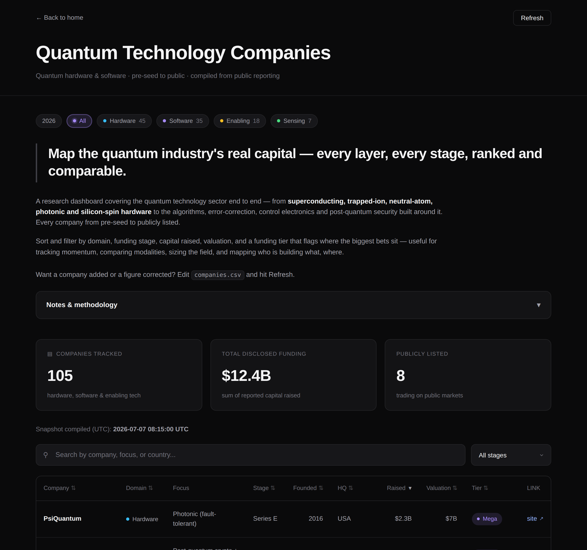

# Quantum Technology Companies

> Map the quantum industry's real capital — every layer, every stage, ranked and comparable.

A research dashboard covering the quantum technology sector end to end — from
**superconducting, trapped-ion, neutral-atom, photonic and silicon-spin hardware** to the
algorithms, error-correction, control electronics, and post-quantum security built around
it. Every company from pre-seed to publicly listed, searchable, filterable, and sortable.



## What's tracked

Each company is placed in one of four **domains**:

| Domain       | What it covers                                                        |
| ------------ | --------------------------------------------------------------------- |
| **Hardware** | qubit systems (superconducting, trapped-ion, neutral-atom, photonic, silicon-spin, …) |
| **Software** | algorithms, error correction, quantum-safe / post-quantum cryptography |
| **Enabling** | control electronics, cryogenics, networking, QPU foundries            |
| **Sensing**  | quantum metrology and magnetometry                                    |

Columns: company, domain, focus/modality, funding stage, year founded, HQ, capital raised,
valuation, and a **funding tier** badge:

- 🟣 **Mega** — $500M or more raised
- 🟡 **Major** — $100M–$500M raised
- 🟢 **Emerging** — under $100M, or undisclosed

The chips above the title filter by **domain**, the dropdown beside the search box filters by
**funding stage**, and both combine with free-text search and column sorting.

## Run it

No dependencies beyond Python 3.8+ (standard library only).

```bash
# 1. Build data.json from the curated source (companies.csv)
python3 build_data.py

# 2. Serve the dashboard (the Refresh button re-runs step 1)
python3 server.py
# → open http://localhost:8000
```

`data.json` is committed, so the dashboard renders immediately.

## View it in the browser (no terminal)

The repo root ships a **single, self-contained `index.html`** (inline CSS/JS with the data
embedded — no fetch, no build step), so GitHub Pages can serve it directly:

- **GitHub Pages, deploy from a branch** — repo **Settings → Pages → Build and deployment →
  Deploy from a branch**, pick this branch and the **`/ (root)`** folder. The dashboard is live
  at `https://<owner>.github.io/<repo>/`. GitHub prints the exact URL at the top of that page.
- **GitHub Pages, via Actions** — alternatively set **Source: GitHub Actions**; the
  `.github/workflows/pages.yml` workflow rebuilds and deploys.
- **GitHub Codespaces** — **Code ▸ Codespaces ▸ Create codespace**, then `python3 server.py`
  and click the forwarded port.

Regenerate the bundled page after editing data with `python3 build_index.py`.

## Add or correct a company

Edit [`companies.csv`](companies.csv) — a pipe-delimited (`|`) file, one company per line:

```
name|domain|focus|stage|founded|hq|total_raised_musd|valuation_musd|url
```

Leave a numeric field blank if undisclosed. Then run `python3 build_data.py` (or click
**Refresh** in the running app). `build_data.py` derives the funding tier, a funding-velocity
figure, and the summary aggregates.

## Data & caveats

Figures are **approximate**, compiled from public reporting — company announcements,
[The Quantum Insider](https://thequantuminsider.com), Crunchbase, and SEC / press filings — as
of mid-2026. Private valuations and undisclosed rounds are estimates; public-company figures
reflect recent market capitalization, which moves daily. This is a **map of the field, not a
valuation source**. Corrections welcome via `companies.csv`.

## How it works

```
companies.csv ──▶ build_data.py ──▶ data.json ──▶ web/ (index.html + app.js)
```

- `companies.csv` — curated, human-editable source of truth.
- `build_data.py` — derives tiers / velocity / aggregates and writes `data.json` (no network I/O).
- `web/` — static dark-themed dashboard: domain filters, search, sortable columns, tier badges.
- `server.py` — stdlib static server plus a `POST /api/refresh` endpoint for the button.
